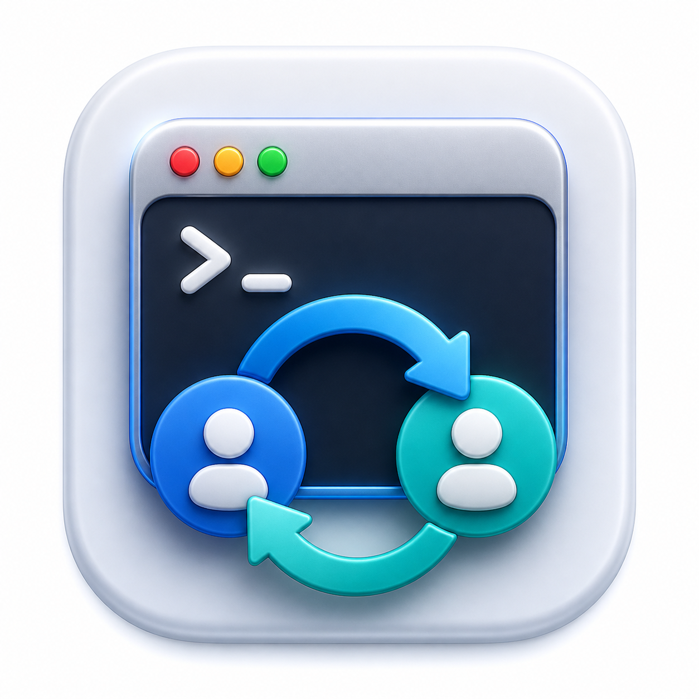
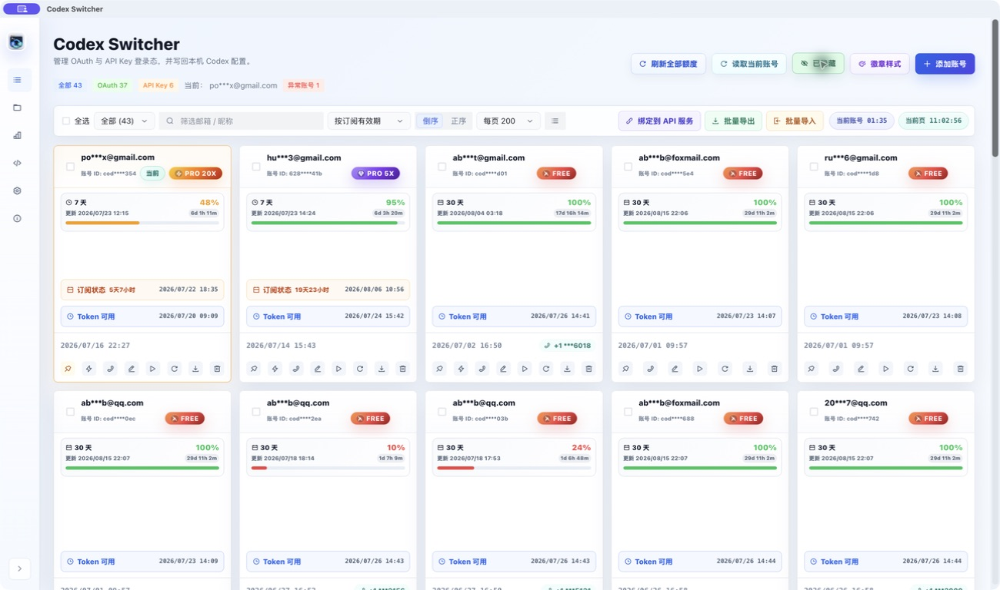
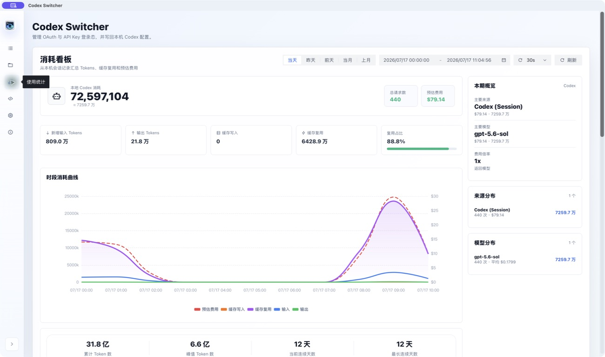
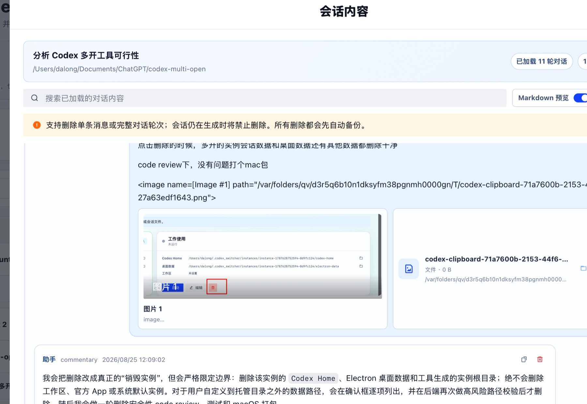
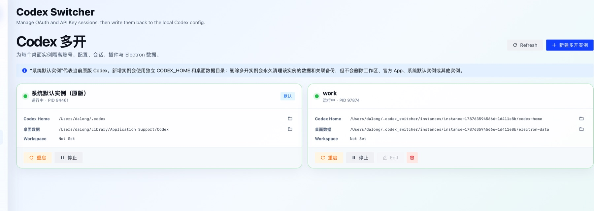
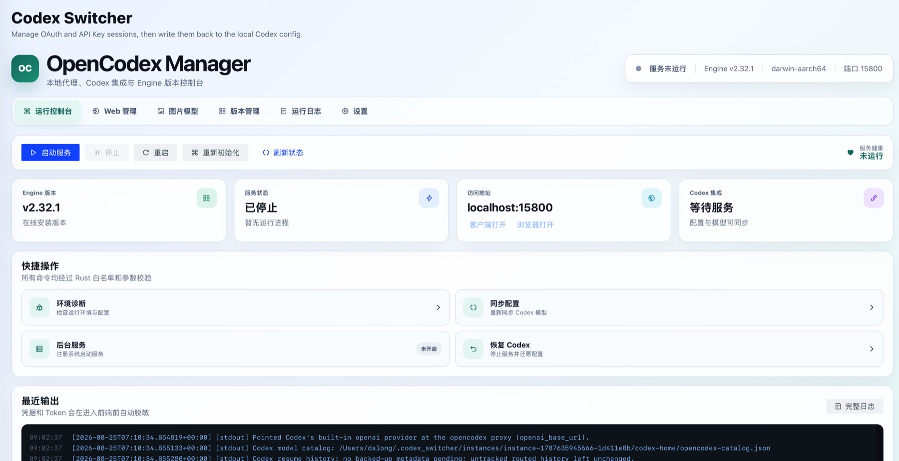
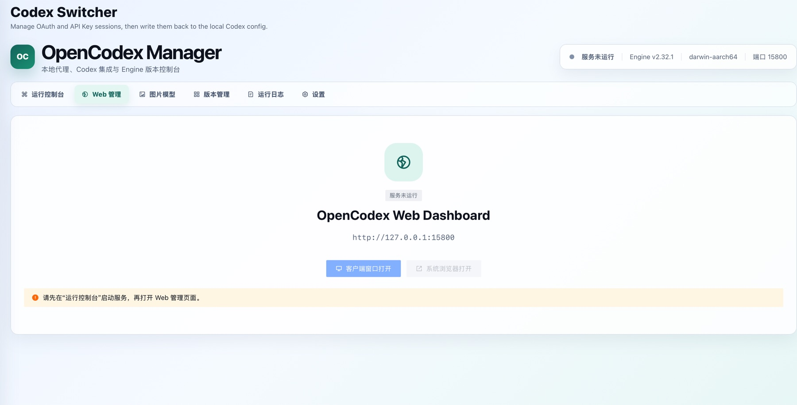

<div align="center">
  
  <h1>Codex Switcher</h1>
  <p>本地优先的 Codex OAuth 与 API Key 多账号管理桌面应用。</p>
  <p>
    <a href="README.md">English</a> |
    <strong>简体中文</strong> |
    <a href="README.zh-TW.md">繁體中文（台灣）</a> |
    <a href="README.ru.md">Русский</a>
  </p>
</div>

Codex Switcher 将多个 Codex 登录配置集中在一个桌面应用中。它可以切换当前账号、隔离运行多个 Codex 桌面实例、修复本机会话、管理 OpenCodex 与 CLIProxyAPI，并提供额度监控、本地 Token 用量统计和费用预估。

## 应用截图

<table>
  <tr>
    <td width="50%"><strong>账号总览与额度监控</strong><br></td>
    <td width="50%"><strong>Token 用量与费用预估</strong><br></td>
  </tr>
  <tr>
    <td width="50%"><strong>会话内容、附件与修复</strong><br></td>
    <td width="50%"><strong>Codex 桌面多开实例</strong><br></td>
  </tr>
  <tr>
    <td width="50%"><strong>OpenCodex 运行控制台</strong><br></td>
    <td width="50%"><strong>OpenCodex Web 管理</strong><br></td>
  </tr>
</table>

## 主要功能

- **OAuth 与 API Key 账号**：添加、编辑、导入、导出、筛选、排序、刷新和切换多个账号。
- **额度监控与重置**：查看可用状态、订阅有效期、额度窗口、GPT 5.3 Codex Spark 额度、重置记录和预约重置。
- **会话管理与修复**：搜索项目和消息内容，预览 Markdown 与附件，删除单条消息或完整轮次，备份、恢复、修复可见性并恢复被截断的会话。
- **Codex 桌面多开（macOS）**：为官方桌面 App 隔离 `CODEX_HOME` 和 Electron 数据，并将账号切换、会话、设置及 OpenCodex 操作定向到所选实例。
- **OpenCodex Manager**：初始化和控制代理、管理 Engine 版本、打开 Web Dashboard、同步模型、配置图片输入兼容、导入 Switcher 账号、查看日志并恢复原生 Codex。
- **使用统计**：汇总本地 Token、缓存、模型和来源分布、预估费用，并支持自定义模型计价规则。
- **CLIProxyAPI 集成**：安装、更新、运行、配置和管理内置 CPA API 服务版本，并绑定选中的账号。
- **配置与备份**：校验并编辑 `auth.json` 和 `config.toml`，自动备份原文件，创建 ZIP 完整备份并恢复历史数据。
- **本地优先隐私**：隐藏账号标识、自动脱敏 OpenCodex 日志，应用数据默认保存在本机。
- **四种界面语言**：English、简体中文、繁體中文（台灣）和 Русский。

## 内置 CPA API 服务

“API 服务”页面基于官方 [CLIProxyAPI（CPA）](https://github.com/router-for-me/CLIProxyAPI) 运行时提供一体化管理，不需要另外手动部署服务。

- **快捷运维**：自动识别当前平台并下载匹配的安装包，可直接在应用内安装、启动、停止、更新或重置服务。
- **账号绑定**：将选中的 OAuth 账号写入 CPA 认证目录，将 API Key 账号写入上游配置，并可查看或删除已经绑定的账号。
- **服务配置**：统一管理监听端口、管理密钥、访问 API Key、自动更新和更新检测间隔。
- **版本管理**：检测官方版本、导入可信的本地安装包、查看已安装版本、切换当前版本和删除非当前版本。
- **安全切换**：CPA 运行中切换版本会自动重启；如果新版本启动失败，Codex Switcher 会恢复到原来的版本。
- **本地工作区**：运行时、配置、认证文件和下载缓存统一保存在 `~/.codex_switcher/api-service`。

## OpenCodex Manager

“OpenCodex”页面将本地 [OpenCodex](https://github.com/lidge-jun/opencodex) 代理及其 Engine 生命周期整合进 Codex Switcher。

- **运行控制台**：在一个页面完成初始化、启动、停止、重启、环境诊断、配置同步、健康检查和脱敏日志查看。
- **Engine 生命周期**：检测稳定版和预览版，安装或切换本地版本，删除非当前版本，并可安全回退到客户端内置基线。
- **Codex 集成**：向所选 Codex 实例同步配置与模型目录，也可停止代理并恢复该实例的原生配置。
- **Web Dashboard**：可在独立客户端窗口或系统浏览器中打开 OpenCodex 管理页面。
- **图片输入兼容**：为仅文本模型选择图片描述 Sidecar，保存后自动重启 OpenCodex 并同步模型目录。
- **账号迁移与后台服务**：导入兼容的 Switcher OAuth 账号，并可将 OpenCodex 注册为登录后自动运行的后台服务。

## 安装

从 [GitHub Releases](https://github.com/vs2pk0/codex-switcher/releases) 下载最新安装包：

- **Windows**：使用 `.exe` 或 `.msi` 安装包。
- **macOS**：打开 `.dmg` 并将 Codex Switcher 移入“应用程序”，或直接运行 `.pkg` 安装包。

如果 macOS 首次启动时阻止应用运行，请前往 **系统设置 > 隐私与安全性**，允许打开该应用。

### macOS 提示“应用已损坏，无法打开”？

当前 macOS 安装包尚未经过公证，Gatekeeper 可能会隔离应用并提示文件已损坏。请先确认安装包来自本项目官方 [GitHub Releases](https://github.com/vs2pk0/codex-switcher/releases)，然后将应用移入 `/Applications` 并执行：

```bash
sudo xattr -rd com.apple.quarantine "/Applications/Codex Switcher.app"
```

执行后重新打开 Codex Switcher。该命令只会移除这个应用的隔离属性；不要对来源不可信的应用执行此命令。

## 基本使用流程

1. 在账号总览中添加 OAuth 或 API Key 账号。
2. 手动刷新账号，读取最新额度或余额。
3. 选择账号并切换，Codex Switcher 会更新本机 Codex 的认证和配置文件。
4. 通过“会话管理”“使用统计”或“API 服务”进行会话恢复、统计分析和 CLIProxyAPI 管理。

### macOS 多开 Codex 桌面实例

进入“Codex 多开”菜单并新建实例，可设置 Codex Home、桌面数据目录、启动工作区和官方 App；数据路径留空时会自动生成在 `~/.codex_switcher/instances` 下。启动前会检查当前官方 App 是否支持独立桌面数据目录。永久删除多开实例时，应用会先停止该实例，再删除它的 Codex Home、Electron 桌面数据、托管目录、会话回收站、配置备份及可确认归属的手动会话备份；工作区、官方 App、系统默认实例和其他实例不会被删除。删除前会校验目录边界，拒绝清理共享目录或相互重叠的数据路径。

存在多个实例时，在账号列表执行切换与重启，以及在 OpenCodex 执行同步或恢复，都会先选择目标实例。会话管理可按实例切换查看与操作，复制会话时也能选择另一个目标实例并生成独立副本。设置页同样可以切换当前实例，查看和编辑该实例的 Codex 路径、`auth.json` 与 `config.toml`。

默认完整备份只包含官方默认实例的会话，并明确排除所有受管理的多开实例数据。多开实例只能在“会话管理”中切换到对应实例后手动备份。

## 本地数据与隐私

应用数据默认存放在 `~/.codex_switcher`，主要包括：

- 账号：`~/.codex_switcher/account/accounts.json`
- 会话：`~/.codex_switcher/session`
- 使用统计：`~/.codex_switcher/statistics`
- 设置：`~/.codex_switcher/data/settings.json`
- 备份：`~/.codex_switcher/backup`

当前账号会写入本机 Codex 目录 `~/.codex`。账号导出文件可能包含认证信息，请妥善保管。

## 赞赏支持

感谢你愿意支持 Codex Switcher。赞赏会用于持续维护、功能开发、测试设备和打包分发成本。如果这个工具帮你节省了时间，欢迎选择下面任意方式支持项目。

<table>
  <tr>
    <th>支付宝</th>
    <th>微信</th>
    <th>Binance</th>
  </tr>
  <tr>
    <td align="center"></td>
    <td align="center"></td>
    <td align="center"></td>
  </tr>
</table>

## 本地开发

### 环境要求

- Node.js 22
- Rust stable 工具链
- 当前平台对应的 [Tauri 2 系统依赖](https://v2.tauri.app/zh-cn/start/prerequisites/)

### 启动开发环境

```bash
npm ci
npm run tauri -- dev
```

### 检查与构建

```bash
npm run typecheck
npm run build
npm run tauri -- build
```

桌面端基于 Tauri 2、Vue 3、TypeScript、Rust、Arco Design 和 ECharts 构建。
